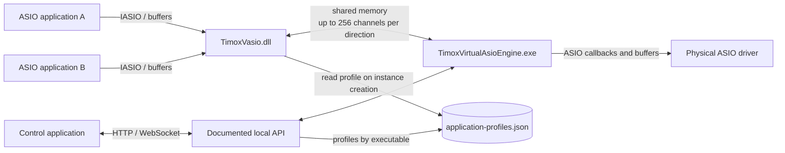

# TimoxVasio architecture

[Français](ARCHITECTURE.md) | **English**

## Purpose

TimoxVasio is a Windows x64 virtual ASIO driver. Its DLL gives applications virtual channels; a separate engine transports and routes their audio to other TimoxVasio clients or a physical ASIO driver. The selected physical driver supplies the master clock, actual sample rate, and block size.

## Overview

The DLL and engine are separate components. The API is the configuration and inventory contract. Control does not directly read shared audio memory or private engine files. See the [API contract](API.en.md) and [driver sequences (French)](docs/DRIVER_SEQUENCES.md).

## Capacity and active channels

Standard capacity is 256 inputs and 256 outputs. Profiles configured through the API can advertise different capacities by direction and executable name. The bundled `mixxx.exe` profile advertises 255/255 to work around the target stable version's 8-bit channel count. The shared transport still has 256 slots per direction.

Each host chooses channels in `createBuffers`. The inventory then lists only allocated channels. API channel numbers start at 1; ASIO `channelNum` indexes start at 0. A count of 255 therefore covers indexes 0–254; a count of 256 covers 0–255.

## Routing

The engine applies API-validated routes in a common audio graph:

1. Virtual output of one process to virtual input of another.
2. Virtual output to physical driver output.
3. Physical driver input to virtual input.

The engine follows the selected physical driver's sample rate and block size. A virtual application requesting different values is refused; no implicit sample-rate conversion takes place.

## Mixxx

The 255-channel profile is a TimoxVasio-side compatibility measure. The generic channel-count representation fix belongs in Mixxx. The [Mixxx compatibility note](docs/mixxx-256-channel-compatibility.md) records the observations, local patch, and validation limits. The sequences provide reproducible material for a Mixxx maintainer; they do not claim a Mixxx PR has already been published.

## License and identity

Original code is released under `GPL-3.0-only`, subject to the ASIO SDK and third-party dependency licenses. The COM name remains `TimoxVasio`. See [Licensing](LICENSING.en.md).
