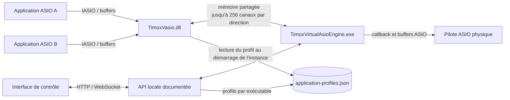

# Architecture de TimoxVasio

**Français** | [English](ARCHITECTURE.en.md)

## Objectif

TimoxVasio est un pilote ASIO virtuel Windows x64. La DLL ASIO fournit aux
applications des canaux virtuels; un moteur distinct transporte et route leur
audio vers d'autres clients TimoxVasio ou vers un pilote ASIO physique. Le
pilote physique sélectionné fournit l'horloge maître, la fréquence et la taille
de bloc effectives.

## Vue d'ensemble

La DLL et le moteur sont des composants séparés. L'API est le contrat de
configuration et d'inventaire; l'interface ne lit pas directement la mémoire
partagée ou les fichiers privés du moteur. Voir [API.md](API.md) et les
[séquences détaillées](docs/DRIVER_SEQUENCES.md).

## Capacité et canaux actifs

La capacité standard est de 256 entrées et 256 sorties. Les profils définis via
l'API peuvent annoncer une capacité différente, indépendamment par direction
et par nom d'exécutable. Le profil embarqué pour `mixxx.exe` annonce 255/255
pour contourner le compteur 8 bits de la version stable visée. Cette limite
concerne l'interface ASIO de l'application : le transport demeure dimensionné
à 256 slots par direction.

Chaque hôte choisit ses canaux lors de `createBuffers`. L'inventaire ne
présente ensuite que les canaux réellement alloués. Les canaux API sont
numérotés à partir de 1; les indices ASIO `channelNum` commencent à 0. Ainsi,
un compte de 255 correspond aux indices 0 à 254, et un compte de 256 aux
indices 0 à 255.

## Routage

Le moteur applique les routes validées par l'API dans un graphe audio commun :

1. sortie virtuelle d'un processus vers entrée virtuelle d'un autre;
2. sortie virtuelle vers sortie du pilote physique;
3. entrée du pilote physique vers entrée virtuelle.

La fréquence et la taille de bloc du moteur suivent le pilote physique choisi.
Une application virtuelle qui demande d'autres valeurs est refusée; aucune
conversion implicite de fréquence n'est effectuée.

## Mixxx et portée de la documentation

La solution de compatibilité 255 canaux est un profil côté TimoxVasio; la
correction générique de la représentation de compte de canaux appartient à
Mixxx. Les constats, le patch local et les limites de validation sont décrits
dans [la note de compatibilité Mixxx](docs/mixxx-256-channel-compatibility.md).
Les séquences donnent les éléments reproductibles pour expliquer le contrat à
un mainteneur Mixxx; elles ne prétendent pas qu'une PR Mixxx a déjà été publiée.

## Licence et identité

Le code original est distribué sous GPL-3.0-only, sous réserve des licences
propres au SDK ASIO et aux dépendances tierces. Le nom COM reste
`TimoxVasio`. Voir [LICENSING.md](LICENSING.md).
