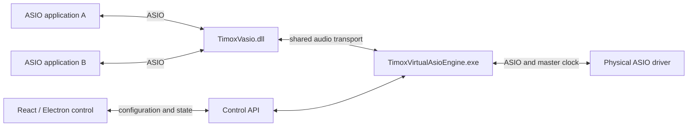

# TimoxVasio

[Français](README.md) | **English**

**Current release: [1.1.0](https://github.com/timox/TimoxVasio/releases/tag/v1.1.0).** The [1.1.0 feature guide](docs/FONCTIONS_1.1.0.en.md) explains the five Control views, channel meters, stereo correlation, and API console with diagrams and examples.

## Purpose

TimoxVasio is one Windows x64 virtual ASIO driver that can expose up to 256 input and 256 output channels to each ASIO application. A separate engine connects channels actually opened by applications to one another and to a physical ASIO driver. A control application configures the physical master device and routes.

## Current state

- `TimoxVasio.dll` and `TimoxVirtualAsioEngine.exe` are separate components; see the [build guide](BUILD_DRIVERS.en.md).
- Local COM probes confirm 256 channels in each direction, including index 255. Other probes cover buffer allocation, transport, and routing.
- The engine uses the selected physical ASIO driver's actual sample rate and block size as the common reference.
- The API reports connected clients, allocated channels, saved routes, and active routes. The interface sends configuration changes through that API.
- Routes saved under an executable name can wait for the application to reconnect, without depending on its former PID.
- Timox VASIO Control shows meters for active routed channels, stereo L/R correlation, Swagger, an API console, and logs.
- Discovery was confirmed with a locally modified Mixxx build. The user also confirmed an end-to-end routed audio test on October 5, 2026; measurement details are not recorded here.

See the [driver sequences](docs/DRIVER_SEQUENCES.en.md), [architecture](ARCHITECTURE.en.md), and [ASIO compliance assessment](ASIO_CONFORMITE.en.md). The [1.1.0 release notes](docs/RELEASE_NOTES_v1.1.0.en.md) and [Windows downloads guide](docs/RELEASE_WINDOWS_1.1.0.en.md) explain the release. Future work is tracked in the [roadmap](docs/ROADMAP.en.md).

## API and support

The [API quick start](docs/API_QUICKSTART.en.md) includes the full architecture and PowerShell/Node.js examples. The detailed contract is in [API.md](API.en.md) and [openapi-v1.json](openapi-v1.json).

You can support development through [GitHub Sponsors](https://github.com/sponsors/timox). See [Funding](docs/FUNDING.en.md) for intended uses.

## Architecture

The driver advertises its maximum capacity. Each application makes available only the channels it actually allocates. The engine builds routes from those channels and the physical device's real inventory.

## Validation and installation

Local builds and probes validate portions of the driver, transport, and engine. The user confirmed an end-to-end audio test in a third-party host on October 5, 2026. Detailed measurements are not reproduced here. See the [build guide](BUILD_DRIVERS.en.md) and [installation guide](INSTALL.en.md).

## License and components

Original code is licensed under GNU GPL version 3 (`GPL-3.0-only`). The ASIO SDK and third-party dependencies retain their own terms. The driver name remains **TimoxVasio**. See [Licensing](LICENSING.en.md).

| Component | Role |
| --- | --- |
| **TimoxVasio** | Virtual ASIO driver loaded by audio applications. |
| **TimoxVirtualAsioEngine** | Transports and routes audio between applications and the physical driver. |
| **Timox VASIO Control** | Electron application for configuration and diagnostics. |

Control and engine communicate through the documented API. The driver name is `TimoxVasio`; the Electron application is `Timox VASIO Control`.
