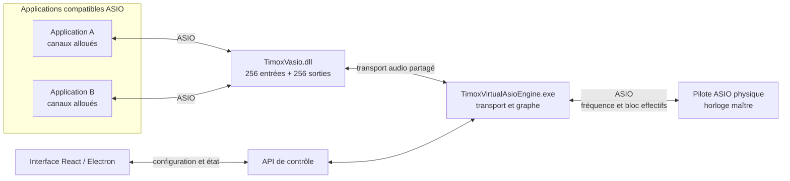

# TimoxVasio — synthèse du projet

Le dépôt public dédié est [TimoxVasio](https://github.com/timox/TimoxVasio). Ce dossier `asio` du dépôt `grrzzzz` conserve un lien vers ce projet et les éléments de travail qui y sont migrés.

## Objectif

Fournir un pilote ASIO virtuel Windows x64 unique, `TimoxVasio`, qui expose jusqu’à 256 canaux d’entrée et 256 canaux de sortie à chaque application compatible ASIO. Un moteur distinct relie les canaux effectivement ouverts par les applications aux entrées et sorties d’un pilote ASIO physique. Une interface configure le périphérique maître et les routes.

## État actuel

- La DLL `TimoxVasio.dll` et le moteur `TimoxVirtualAsioEngine.exe` sont deux composants distincts; les builds sont documentés dans [BUILD_DRIVERS.md](BUILD_DRIVERS.md).
- La sonde COM confirme 256 canaux dans chaque direction, jusqu’à l’index 255. Des probes couvrent aussi l’allocation de buffers, le transport et le graphe de routage.
- Le moteur ouvre le pilote ASIO physique choisi et utilise sa fréquence et sa taille de bloc effectives comme référence commune.
- L’API publie les clients et les canaux réellement alloués; la GUI transmet les changements de configuration à cette API.
- La découverte de `TimoxVasio` a été confirmée avec une build locale modifiée de Mixxx. La validation complète d’un signal routé jusqu’au matériel reste à faire.

Les séquences ASIO, les profils API et le chemin Mixxx sont illustrés dans [DRIVER_SEQUENCES.md](docs/DRIVER_SEQUENCES.md). L'architecture est résumée dans [ARCHITECTURE.md](ARCHITECTURE.md). Les preuves et limites du contrôle de protocole sont résumées dans [ASIO_CONFORMITE.md](ASIO_CONFORMITE.md). Les décisions détaillées sont dans la [spécification](docs/superpowers/specs/2026-10-03-vasio-single-driver-256-channel-design.md) et le [plan de réalisation](docs/superpowers/plans/2026-10-03-vasio-256-physical-master-plan.md).

## Architecture simplifiée

Le pilote virtuel annonce sa capacité maximale. Chaque application ne rend disponibles que les canaux qu’elle a effectivement alloués. Le moteur construit les routes depuis ces canaux et l’inventaire réel du périphérique physique. Le détail du contrat figure dans la [spécification](docs/superpowers/specs/2026-10-03-vasio-single-driver-256-channel-design.md).

## Vérifications et prochaine preuve

Les builds et probes locaux valident des parties du pilote, du transport et du moteur; ils ne remplacent pas le test dans un hôte tiers. La validation de bout en bout consiste à ouvrir `TimoxVasio` dans un hôte ASIO, appliquer une route dans l’interface, lire un signal et le mesurer sur la sortie matérielle choisie.

Voir [BUILD_DRIVERS.md](BUILD_DRIVERS.md) pour reconstruire et sonder les composants, et [INSTALL.md](INSTALL.md) pour l’installation.

## Licence

Le code original est sous GNU GPL version 3 (`GPL-3.0-only`). Les licences ASIO SDK et des dépendances tierces gardent leurs propres termes. Le nom du pilote reste **TimoxVasio**. Voir [LICENSING.md](LICENSING.md).
