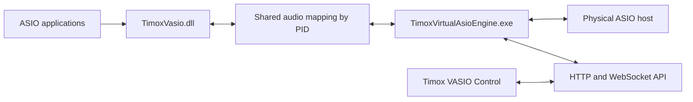

# TimoxVasio engine structure

[Français](STRUCTURE.md) | **English**

## Current architecture

`TimoxVasio.dll` is the only virtual ASIO driver. It advertises 256 inputs and 256 outputs; each client selects its channels with `createBuffers`. The engine identifies clients by PID and maintains a versioned shared mapping for each client.

The selected physical ASIO driver provides the clock, sample rate, and buffer size. `PhysicalAsioHost` creates buffers only for physical channels referenced by routes; hardware indices are preserved in the graph.

## Components

The product has three separate components: the virtual ASIO driver `TimoxVasio.dll`, the engine `TimoxVirtualAsioEngine.exe`, and the Electron interface `Timox VASIO Control`. The interface configures the engine through the documented API; audio applications load the ASIO driver.

- `src/vasio_driver.cpp` and `src/audio_transport.cpp`: ASIO contract, client allocation, and shared 256/256 transport.
- `src/vasio_client_manager.cpp`: discovery and snapshots of active clients.
- `src/physical_asio_host.cpp`: enumeration, capabilities after applying the sample rate, routed hardware buffers, and physical callback.
- `src/audio_routing_runtime.cpp` and `src/routing_graph.cpp`: active endpoints and processing for the three link types.
- `src/audio_controller.cpp`: reconfiguration while stopped, hardware validation, and state publication.
- `src/control_api_server.cpp`: inventory, configuration, and HTTP/WebSocket events.
- `gui/electron/` and `gui/src/`: client interface for the documented API.

## Artifacts and contracts

- Driver DLL: `TimoxVasio.dll`; CMake target: `TimoxVasio`.
- Engine: `TimoxVirtualAsioEngine.exe`; CMake target: `TimoxVirtualAsioEngine`.
- API contract: [API.en.md](API.en.md), [openapi-v1.json](openapi-v1.json), and [schemas/api-v1.json](schemas/api-v1.json).
- Design and acceptance criteria: [256-channel specification](docs/superpowers/specs/2026-10-03-vasio-single-driver-256-channel-design.en.md).
