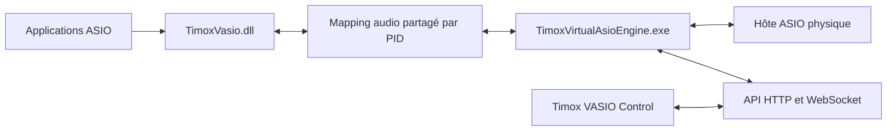

# Structure du moteur TimoxVasio

## Architecture active

`TimoxVasio.dll` est l’unique pilote ASIO virtuel. Il annonce 256 entrées et 256 sorties; chaque client choisit ses canaux avec `createBuffers`. Le moteur identifie les clients par PID et maintient un mapping partagé versionné par client.

Le pilote ASIO physique sélectionné fournit l’horloge, la fréquence et la taille de buffer. `PhysicalAsioHost` crée des buffers uniquement pour les canaux physiques référencés par les routes; les index matériels sont conservés dans le graphe.

## Composants

Le produit comporte trois composants distincts : le pilote ASIO virtuel
`TimoxVasio.dll`, le moteur `TimoxVirtualAsioEngine.exe` et l’interface
Electron `Timox VASIO Control`. L’interface configure le moteur par l’API
documentée; les applications audio chargent le pilote ASIO.

- `src/vasio_driver.cpp` et `src/audio_transport.cpp` : contrat ASIO, allocation client et transport partagé 256/256.
- `src/vasio_client_manager.cpp` : découverte et snapshots des clients actifs.
- `src/physical_asio_host.cpp` : énumération, capacités après application du taux, buffers matériels routés et callback physique.
- `src/audio_routing_runtime.cpp` et `src/routing_graph.cpp` : endpoints actifs et traitement des trois types de liaisons.
- `src/audio_controller.cpp` : reconfiguration arrêtée, validation du matériel et publication des états.
- `src/control_api_server.cpp` : inventaire, configuration et événements HTTP/WebSocket.
- `gui/electron/` et `gui/src/` : interface cliente de l’API documentée.

## Artefacts et contrats

- DLL pilote : `TimoxVasio.dll` ; cible CMake : `TimoxVasio`.
- Moteur : `TimoxVirtualAsioEngine.exe` ; cible CMake : `TimoxVirtualAsioEngine`.
- Contrat API : [API.md](API.md), [openapi-v1.json](openapi-v1.json) et [schemas/api-v1.json](schemas/api-v1.json).
- Conception et critères d’acceptation : [spécification 256 canaux](docs/superpowers/specs/2026-10-03-vasio-single-driver-256-channel-design.md).
