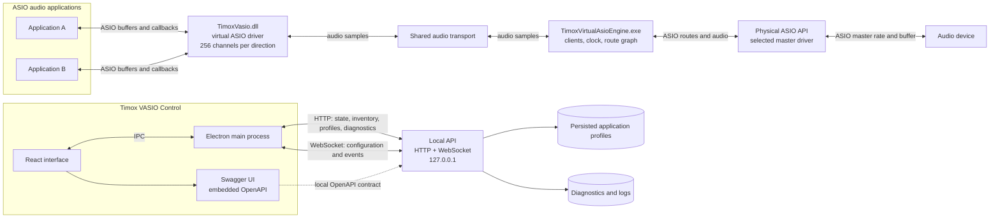

# TimoxVasio API — architecture and quick start

[Français](API_QUICKSTART.md) | **English**

This guide introduces the components and first requests for integrating a tool with the engine. For the complete contract, schemas, and errors, see the [API reference](../API.en.md), [OpenAPI contract](../openapi-v1.json), and [JSON schemas](../schemas/api-v1.json). The [1.1.0 feature guide](FONCTIONS_1.1.0.en.md) illustrates views and measurements.

## Full architecture



Audio travels through driver, shared transport, engine, routes, and physical driver. The API carries control and observation, not audio samples. Electron consumes the same API; Swagger displays the embedded contract.

## 1. Connect and read state

The server listens only on `127.0.0.1`, normally on port `52525`. If a dynamic port is chosen, startup emits `{"event":"api.ready","port":...}`. It is not exposed on the network.

```powershell
$port = 52525
$base = "http://127.0.0.1:$port"

$state = Invoke-RestMethod "$base/api/v1/state"
$state.engine | Format-List
$state.routes | Format-Table id, sourceEndpointId, destinationEndpointId
$state.configuredRoutes | Format-Table id, sourceEndpointId, destinationEndpointId
$state.stereoPairs | Format-Table id, label

$drivers = Invoke-RestMethod "$base/api/v1/drivers"
$drivers.physicalDrivers | Select-Object name, id, capabilitiesKnown
```

`configuredRoutes` lists all saved routes; `routes` lists those currently active. Reuse opaque driver and endpoint `id` values exactly as returned. Physical capabilities may be unknown until opening the driver.

## 2. Set application channel profiles

`GET /api/v1/application-profiles` reads the complete list:

```powershell
$current = Invoke-RestMethod "$base/api/v1/application-profiles"
$current.profiles | Format-Table processName, inputChannels, outputChannels
```

`PUT` replaces it; include profiles you want to retain:

```powershell
$body = @{
    profiles = @(
        @{ processName = 'mixxx.exe'; inputChannels = 255; outputChannels = 255 },
        @{ processName = 'renoise.exe'; inputChannels = 64; outputChannels = 64 }
    )
} | ConvertTo-Json -Depth 5

$updated = Invoke-RestMethod `
    -Method Put `
    -Uri "$base/api/v1/application-profiles" `
    -ContentType 'application/json' `
    -Body $body

$updated.restartRequiredClients | Format-Table processName, pid
```

Counts range from 1 to 256. An empty list restores default 256/256. Close and reopen clients in `restartRequiredClients`; the API does not restart applications for you.

## 3. Apply audio configuration

Use WebSocket subprotocol `vasio.api.v1` at `ws://127.0.0.1:<port>/api/v1/ws`. On connection, the engine sends `engine.status` and `devices.changed`. Replace all example IDs below with current inventory IDs.

If the physical driver is not yet open, `capabilitiesKnown` may be `false` and endpoints unavailable. First select and open it without routes:

```json
{
  "id": "open-driver-1",
  "command": "configuration.apply",
  "payload": {
    "physicalDriverId": "<physical driver ID returned by API>",
    "sampleRate": null,
    "bufferFrames": null,
    "routes": []
  }
}
```

After acknowledgement, read `/api/v1/state` or `/api/v1/drivers` again. Start the source ASIO application and read its actually opened virtual endpoints. If driver and endpoints are already known, proceed directly.

This Node.js example uses `ws` (`npm install ws`):

```javascript
const WebSocket = require('ws');
const port = Number(process.env.VASIO_API_PORT || 52525);
const socket = new WebSocket(`ws://127.0.0.1:${port}/api/v1/ws`, 'vasio.api.v1');

socket.on('message', data => {
  const message = JSON.parse(data.toString());
  if (message.id === 'apply-1') {
    if (message.success) console.log('Configuration accepted');
    else console.error('Configuration rejected', message.error);
    return;
  }
  if (message.event) console.log(message.event, message.payload);
});

socket.on('open', () => {
  socket.send(JSON.stringify({
    id: 'apply-1',
    command: 'configuration.apply',
    payload: {
      physicalDriverId: '<physical driver ID returned by API>',
      sampleRate: null,
      bufferFrames: null,
      routes: [{
        id: 'route-1',
        sourceEndpointId: 'virtual:TimoxVasio:<pid>:output:1',
        destinationEndpointId: 'physical:<driverId>:output:1',
        gainDb: 0,
        mute: false
      }]
    }
  }));
});
```

`sampleRate: null` requests the selected driver's current rate; `bufferFrames: null` requests its preferred size. Explicit supported values are also accepted. See [routing rules](../API.en.md#routing-rules). `configuration.apply` replaces the entire driver, parameter, and route configuration. Repeating it does not duplicate routes but may briefly rebuild the audio stream. A new waiting virtual route may use `virtual:TimoxVasio:app:<executable>:output:<channel>` if the executable has a registered profile and the channel is within it. A matching `id` response accepts or rejects the command; later events report confirmed state. `audio.meter` events carry peaks and transport counters, not samples.

## 4. Observe levels and correlation

`audio.meter` reports peaks for routed endpoints. In **Channels**, client meters appear only for open, routed channels. `underruns` and `overruns` count shared transport incidents.

Find measurable L/R pairs in `stereoPairs` and use an `id` actually returned by `/api/v1/state`:

```json
{
  "id": "analysis-1",
  "command": "audio.correlation.start",
  "payload": { "stereoPairId": "stereo:TimoxVasio:1234:output:1-2" }
}
```

`audio.correlation` events return a coefficient from `-1` to `+1`. With no measurable signal, `correlation` is `null` and `state` is `no_signal`. To stop, send `{"id":"analysis-stop","command":"audio.correlation.stop"}`. See the [feature guide](FONCTIONS_1.1.0.en.md) for diagrams and a Node.js event listener.

## 5. Read diagnostics

```powershell
$diagnostics = Invoke-RestMethod "$base/api/v1/diagnostics?limit=50"
$diagnostics.level
$diagnostics.entries | Format-Table timestamp, level, component, message

Invoke-RestMethod `
    -Method Put `
    -Uri "$base/api/v1/diagnostics" `
    -ContentType 'application/json' `
    -Body '{"level":"debug"}'
```

Logs are stored at `%LOCALAPPDATA%\TimoxVasio\logs\engine.log`. `debug` adds control events; it does not log audio samples.
