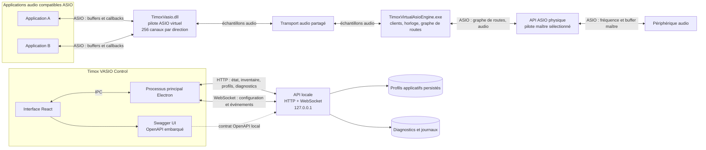

# TimoxVasio API — architecture et quick start

Ce guide présente les composants et les premières requêtes utiles pour
intégrer un outil au moteur. Pour le contrat complet, les schémas et la liste
des erreurs, voir la [référence API](../API.md), le
[contrat OpenAPI](../openapi-v1.json) et les
[schémas JSON](../schemas/api-v1.json).

## Architecture complète



Le chemin audio passe par le pilote, le transport partagé, le moteur et les
routes vers le pilote physique. L’API sert au contrôle et à l’observation; elle
ne transporte pas les échantillons audio. L’interface Electron consomme cette
même API. Swagger présente le contrat embarqué.

## 1. Se connecter et lire l’état

Le serveur écoute uniquement sur `127.0.0.1`. Le port par défaut est `52525`;
si le moteur démarre sur un port attribué dynamiquement, il annonce le port dans
son événement de démarrage `{"event":"api.ready","port":...}`. L’API n’est
pas exposée au réseau.

Exemples PowerShell :

```powershell
$port = 52525
$base = "http://127.0.0.1:$port"

$state = Invoke-RestMethod "$base/api/v1/state"
$state.engine | Format-List
$state.routes | Format-Table id, sourceEndpointId, destinationEndpointId

$drivers = Invoke-RestMethod "$base/api/v1/drivers"
$drivers.physicalDrivers | Select-Object name, id, capabilitiesKnown
```

`/api/v1/state` fournit l’état confirmé, les routes et les inventaires. Les
identifiants `id` des pilotes et des extrémités sont opaques : réutilisez
exactement ceux retournés par l’API. Les extrémités physiques peuvent ne pas
avoir de capacités connues avant l’ouverture du pilote.

## 2. Définir les profils de canaux

La route `GET /api/v1/application-profiles` lit la liste complète :

```powershell
$current = Invoke-RestMethod "$base/api/v1/application-profiles"
$current.profiles | Format-Table processName, inputChannels, outputChannels
```

`PUT` remplace toute la liste. Incluez les profils à conserver :

```powershell
$body = @{
    profiles = @(
        @{ processName = 'mixxx.exe'; inputChannels = 255; outputChannels = 255 },
        @{ processName = 'renoise.exe'; inputChannels = 64; outputChannels = 64 }
    )
} | ConvertTo-Json -Depth 5

$updated = Invoke-RestMethod `
    -Method Put `
    -Uri "$base/api/v1/application-profiles" `
    -ContentType 'application/json' `
    -Body $body

$updated.restartRequiredClients | Format-Table processName, pid
```

Les comptes vont de 1 à 256. Une liste vide rétablit le défaut 256/256. Fermez
puis relancez les clients listés dans `restartRequiredClients` afin qu’ils
réannoncent leur capacité. La requête ne redémarre pas les applications.

## 3. Appliquer une configuration audio

La configuration se transmet par WebSocket, avec le sous-protocole
`vasio.api.v1`, à `ws://127.0.0.1:<port>/api/v1/ws`. À l’ouverture, le moteur
envoie `engine.status` puis `devices.changed`. Les identifiants de source et de
destination ci-dessous sont des exemples : remplacez-les par les identifiants
présents dans l’état courant.

Si le pilote physique n’a pas encore été ouvert, son inventaire peut annoncer
`capabilitiesKnown: false` et ne pas encore fournir d’extrémités. Dans ce cas,
envoyez d’abord une configuration sans route pour sélectionner et ouvrir le
pilote :

```json
{
  "id": "open-driver-1",
  "command": "configuration.apply",
  "payload": {
    "physicalDriverId": "<id physique retourné par l’API>",
    "sampleRate": null,
    "bufferFrames": null,
    "routes": []
  }
}
```

Après l’acquittement, relisez `/api/v1/state` ou `/api/v1/drivers` pour obtenir
les extrémités physiques. Lancez aussi l’application ASIO source et relisez
l’état pour obtenir ses extrémités virtuelles effectivement ouvertes. Utilisez
ensuite ces identifiants pour construire les routes. Si le pilote et les
extrémités sont déjà présents dans l’inventaire, passez directement à l’étape
suivante.

Cet exemple Node.js utilise le paquet `ws` (`npm install ws`) :

```javascript
const WebSocket = require('ws');

const port = Number(process.env.VASIO_API_PORT || 52525);
const socket = new WebSocket(
  `ws://127.0.0.1:${port}/api/v1/ws`,
  'vasio.api.v1'
);

socket.on('message', (data) => {
  const message = JSON.parse(data.toString());

  if (message.id === 'apply-1') {
    if (message.success) console.log('Configuration acceptée');
    else console.error('Configuration refusée', message.error);
    return;
  }

  if (message.event) console.log(message.event, message.payload);
});

socket.on('open', () => {
  socket.send(JSON.stringify({
    id: 'apply-1',
    command: 'configuration.apply',
    payload: {
      physicalDriverId: '<id physique retourné par l’API>',
      sampleRate: null,
      bufferFrames: null,
      routes: [{
        id: 'route-1',
        sourceEndpointId: 'virtual:TimoxVasio:<pid>:output:1',
        destinationEndpointId: 'physical:<driverId>:output:1',
        gainDb: 0,
        mute: false
      }]
    }
  }));
});
```

`sampleRate: null` demande le taux courant du pilote choisi et
`bufferFrames: null` sa taille préférée. On peut fournir des valeurs explicites
annoncées par le pilote. Les types de routes autorisés sont décrits dans la
[référence](../API.md#règles-de-routage).

`configuration.apply` remplace le pilote, les paramètres et la liste entière
des routes : incluez toutes celles à conserver. Répéter la même configuration
est idempotent. La réponse avec le même `id` acquitte ou rejette la commande;
les événements suivants, dont `engine.status` et `routes.changed`, indiquent
l’état confirmé. Les événements `audio.meter` donnent un niveau de crête et
des compteurs de sous-débordement/sur-débordement; ils ne transportent pas
l’audio.

## 4. Consulter les diagnostics

```powershell
$diagnostics = Invoke-RestMethod "$base/api/v1/diagnostics?limit=50"
$diagnostics.level
$diagnostics.entries | Format-Table timestamp, level, component, message
```

Pour activer les détails supplémentaires :

```powershell
Invoke-RestMethod `
    -Method Put `
    -Uri "$base/api/v1/diagnostics" `
    -ContentType 'application/json' `
    -Body '{"level":"debug"}'
```

Les journaux sont enregistrés sous `%LOCALAPPDATA%\TimoxVasio\logs\engine.log`.
Le mode `debug` ajoute des événements de contrôle; aucun échantillon audio
n’est écrit.
