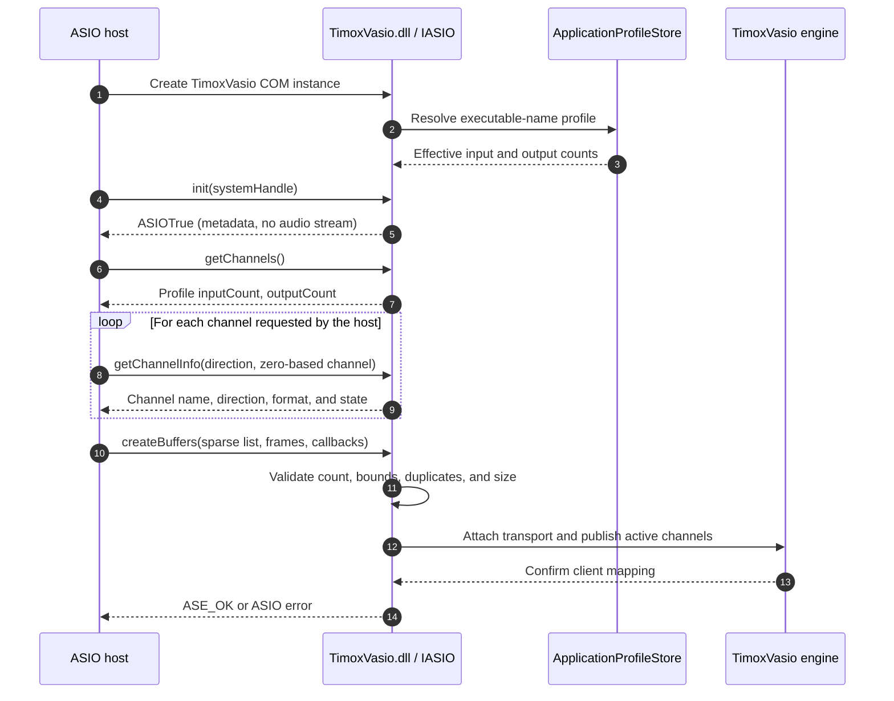
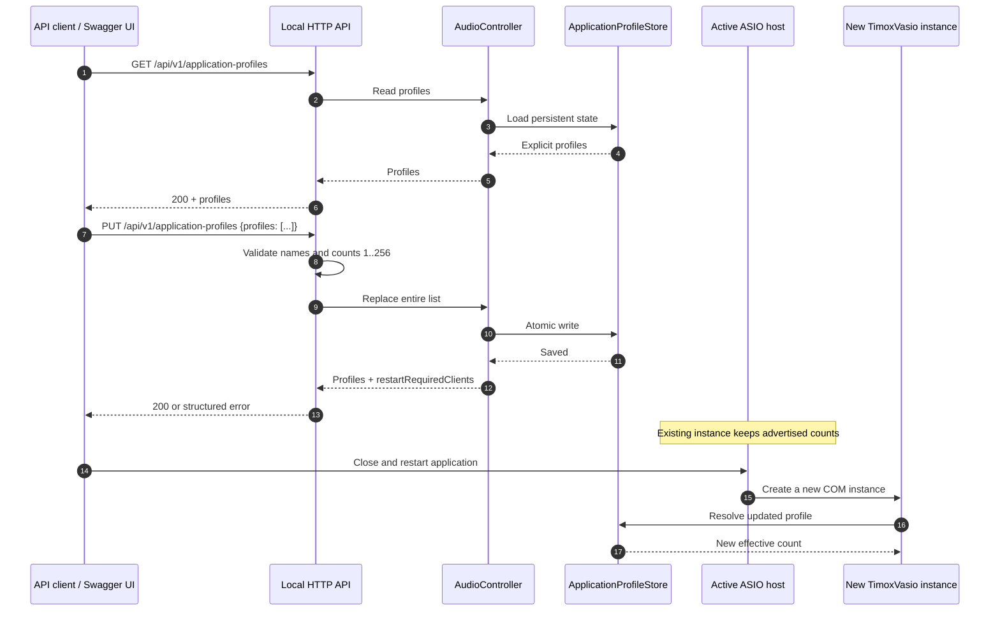
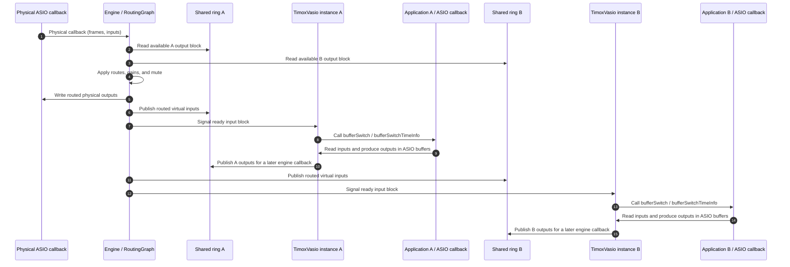
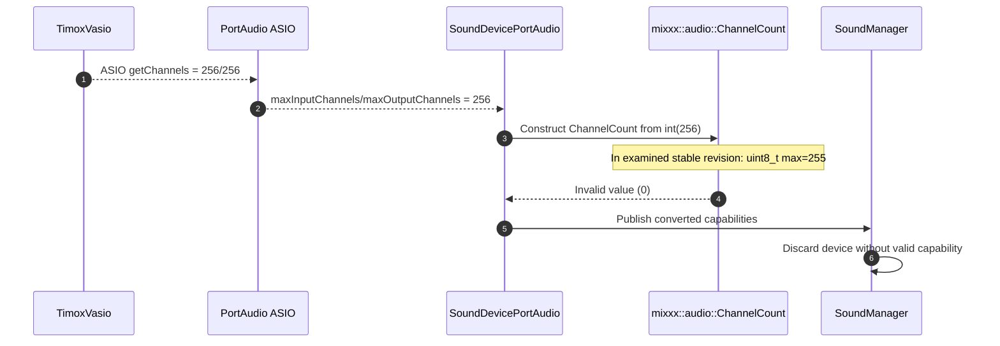
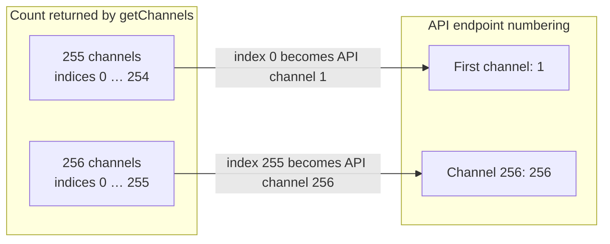

# TimoxVasio driver sequences

[Français](DRIVER_SEQUENCES.md) | **English**

This page describes observable exchanges among the ASIO host, DLL, API, engine, and physical driver. GitHub can render the Mermaid diagrams directly. They distinguish the channel count advertised to a host from the channels actually allocated and transported.

## 1. ASIO discovery and allocation

The host loads the driver registered under the stable name `TimoxVasio`, queries its capabilities, then selects the channels to open. The driver instance reads the profile before advertising its capabilities.

`init` lets the host request driver metadata even when the audio engine has not started. Buffer creation, however, requires the engine's transport and clock. Metadata probes alone therefore do not establish that audio streaming works.

Bounds are directional. With an input count of 255, valid indices are 0–254; index 255 is rejected for that direction. Output counts are checked separately. Requests may be sparse, but an out-of-range or duplicate channel in the same direction is rejected.

## 2. Per-application profile through the API and Swagger/OpenAPI

The API supports reading the complete list and replacing it atomically. Profiles are keyed by the executable basename, compared case-insensitively. A change does not alter an already open ASIO instance: the host must restart to query the driver again.

The `PUT` route replaces the complete list; sending `profiles: []` removes overrides and applies the 256/256 default. The initial 255/255 `mixxx.exe` profile is provided by default when the profile file does not exist. Saved changes are shared by the API and DLL through `%LOCALAPPDATA%\TimoxVasio\application-profiles.json`. The API and its normative OpenAPI schemas are described in [API.en.md](../API.en.md) and [`openapi-v1.json`](../openapi-v1.json).

Valid counts range from 1 through 256 inclusive. Each profile contains `processName`, `inputChannels`, and `outputChannels`. The API returns `restartRequiredClients` to identify connected clients whose effective capability changes. Host restart is manual; the API does not close any process.

## 3. Audio transport and routing

After ASIO allocation, each application's callbacks exchange samples with its shared ring. The physical driver's callback sets the processing cadence; the engine then applies the current graph.

On each physical callback, the engine reads available client output blocks, applies the graph, fills physical outputs, writes virtual inputs into the mappings, and wakes client callbacks. A client callback reads its ASIO inputs, lets the application produce outputs, then publishes them for a later engine callback. Callbacks do not communicate directly between applications; they pass through the engine and graph. The engine processes active channels declared at allocation.

Profiles do not resize the rings: each client keeps transport capacity for up to 256 channels per direction. They only limit what the application can discover and allocate. Thus two applications with different profiles can communicate through common channels made active and connected by API routes.

## 4. Sequence relevant to a Mixxx PR

The TimoxVasio workaround advertises 255 channels to `mixxx.exe`; it does not prove that Mixxx can represent 256. The examined stable version receives a count from ASIO/PortAudio, converts it to its `ChannelCount` type, then filters invalid values during inventory. At 256, the 8-bit type observed in that revision produces the invalid sentinel value 0.

This diagram describes the path observed in the Mixxx commit identified in the [compatibility note](mixxx-256-channel-compatibility.en.md). For a Mixxx PR, include the exact commit, source lines for the type and conversion, the PortAudio trace receiving 256, and a focused test covering 255, 256, and the higher capability being rejected or represented. A general fix must preserve 256 through the type and discovery/selection/allocation paths; the TimoxVasio-side 255 profile is a workaround for the stable version, not proof of Mixxx compliance with 256 channels.

## 5. Index conventions

ASIO `channelNum` is zero-based; endpoint identifiers published by the API use one-based channel numbers. The mapping preserves channel identity and does not imply that index 255 exists in a profile advertising 255 channels.
