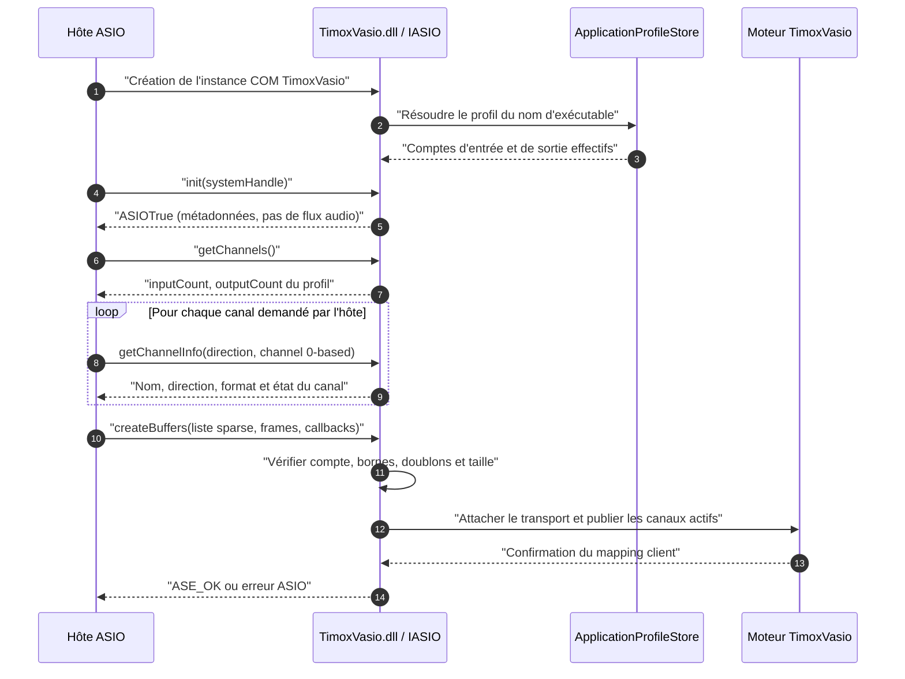
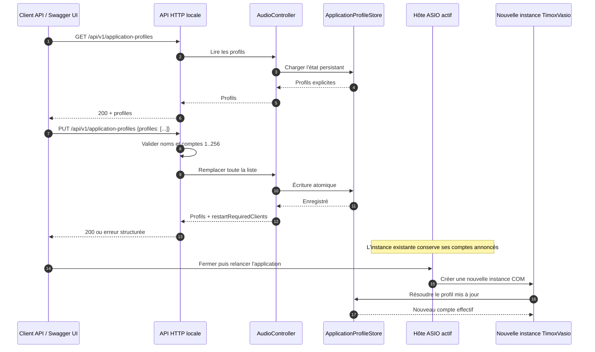
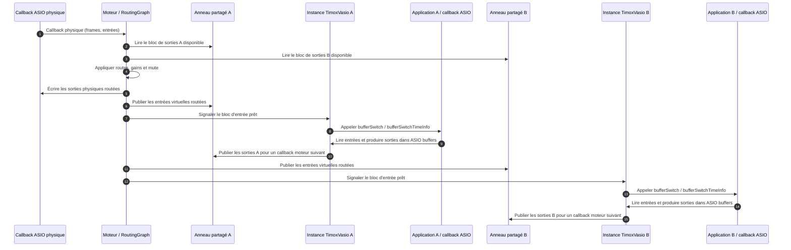
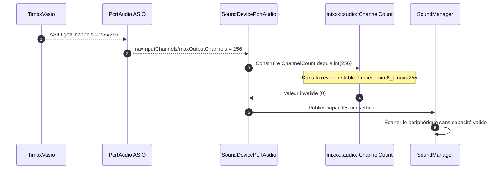
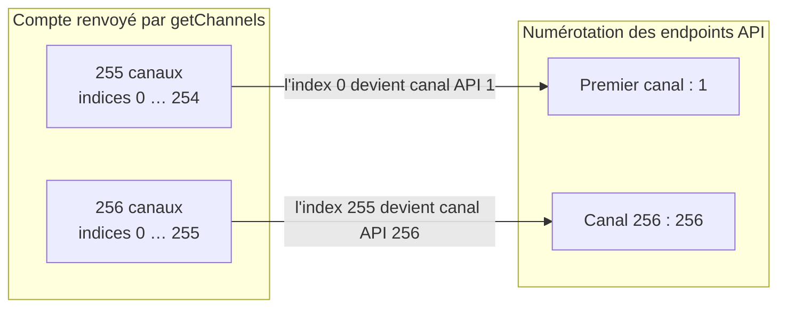

# Séquences du pilote TimoxVasio

Cette page décrit les échanges observables entre l'hôte ASIO, la DLL, l'API,
le moteur et le pilote physique. Les diagrammes Mermaid peuvent être rendus
directement par GitHub. Ils distinguent le nombre de canaux annoncé à un hôte
du nombre de canaux réellement alloués et transportés.

## 1. Découverte et allocation ASIO

L'hôte charge le pilote enregistré sous le nom stable `TimoxVasio`, interroge
les capacités, puis choisit les canaux qu'il souhaite ouvrir. La lecture du
profil intervient dans l'instance du pilote avant l'annonce des capacités.

`init` permet à l'hôte de demander les métadonnées du pilote même lorsque le
moteur audio n'a pas démarré. La création des buffers, elle, a besoin du
transport et de l'horloge du moteur. Les probes de métadonnées n'impliquent
donc pas à elles seules qu'un flux audio fonctionne.

Les bornes sont directionnelles. Avec un compte d'entrée de 255, les indices
valides sont 0–254; l'index 255 est refusé pour cette direction. Les comptes
de sortie sont vérifiés séparément. Les requêtes peuvent être clairsemées, mais
un canal hors limite ou dupliqué dans la même direction est refusé.

## 2. Profil par application via l'API et Swagger/OpenAPI

L'API propose une lecture de la liste complète et un remplacement atomique de
cette liste. Le profil est indexé par le basename de l'exécutable, comparé sans
distinction de casse. Une modification ne change pas une instance ASIO déjà
ouverte : l'hôte doit redémarrer pour interroger le pilote à nouveau.

La route `PUT` remplace la liste complète; envoyer `profiles: []` retire les
dérogations et applique le défaut 256/256. Le profil initial `mixxx.exe`
255/255 est fourni par défaut lorsque le fichier de profils n'existe pas. Les
modifications enregistrées sont partagées par l'API et la DLL via
`%LOCALAPPDATA%\TimoxVasio\application-profiles.json`. L'API et ses schémas
OpenAPI normatifs sont décrits dans [API.md](../API.md) et
[`openapi-v1.json`](../openapi-v1.json).

Les comptes valides sont de 1 à 256 inclusivement. Chaque profil contient
`processName`, `inputChannels` et `outputChannels`. L'API renvoie
`restartRequiredClients` pour signaler les clients connectés dont la capacité
effective change. Le redémarrage de l'hôte est manuel; l'API ne ferme aucun
processus.

## 3. Transport et routage audio

Après l'allocation ASIO, les callbacks de chaque application échangent les
échantillons avec leur anneau partagé. Le callback du pilote physique fournit
la cadence de traitement; le moteur applique ensuite le graphe courant.

À chaque callback physique, le moteur lit les blocs de sortie client déjà
disponibles, applique le graphe, remplit les sorties physiques, écrit les
entrées virtuelles dans les mappings puis réveille les callbacks clients. Le
callback client lit ses entrées ASIO, laisse l'application produire ses
sorties, puis publie celles-ci pour un callback moteur suivant. Les callbacks
ne communiquent pas directement entre applications : ils passent par le moteur
et le graphe. Le moteur traite les canaux actifs déclarés à l'allocation.

Les profils ne redimensionnent pas les anneaux : chaque client conserve un
transport pouvant contenir jusqu'à 256 canaux par direction. Ils limitent
uniquement ce que l'application est autorisée à découvrir et à allouer. Ainsi,
deux applications ayant des profils différents peuvent communiquer sur les
canaux communs rendus actifs et reliés par des routes API.

## 4. Séquence pertinente pour une PR Mixxx

Le contournement TimoxVasio annonce 255 canaux à `mixxx.exe`; il ne prouve pas
que 256 est représentable par Mixxx. La version stable étudiée reçoit un
compte depuis ASIO/PortAudio, le convertit dans son type `ChannelCount`, puis
filtre les valeurs invalides lors de l'inventaire. À 256, le type 8 bits
observé dans cette révision produit la valeur sentinelle invalide 0.

Ce diagramme décrit le chemin constaté dans le commit Mixxx identifié dans
[la note de compatibilité](mixxx-256-channel-compatibility.md). Pour une PR
Mixxx, joindre le commit exact, les lignes/source du type et de la conversion,
la trace PortAudio recevant 256, puis un test ciblé qui couvre 255, 256 et la
capacité supérieure rejetée ou représentée. Une correction générique doit
préserver 256 dans le type et les chemins de découverte/sélection/allocation;
le profil 255 côté TimoxVasio est un contournement pour la version stable, pas
une preuve de conformité Mixxx à 256 canaux.

## 5. Conventions d'index

ASIO `channelNum` est indexé à partir de zéro; les identifiants d'extrémité
publiés par l'API utilisent des numéros à partir de un. Le mapping conserve
l'identité du canal et ne signifie pas que l'index 255 existe dans un profil
annonçant 255 canaux.
