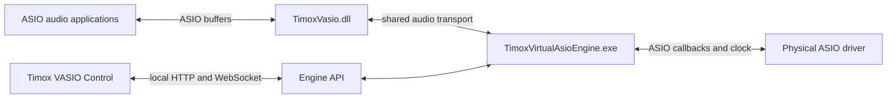
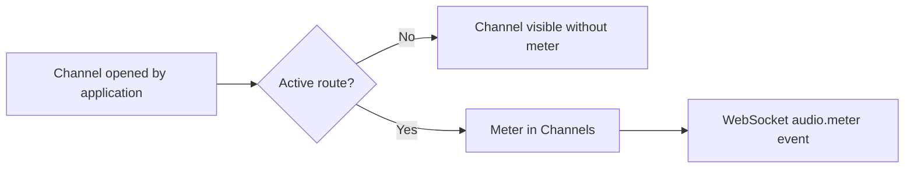
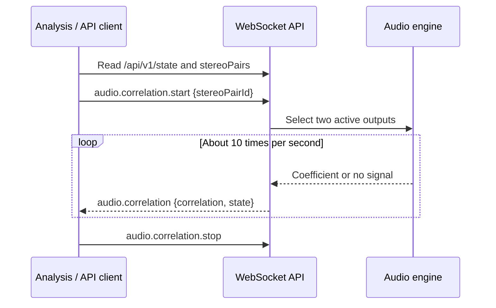
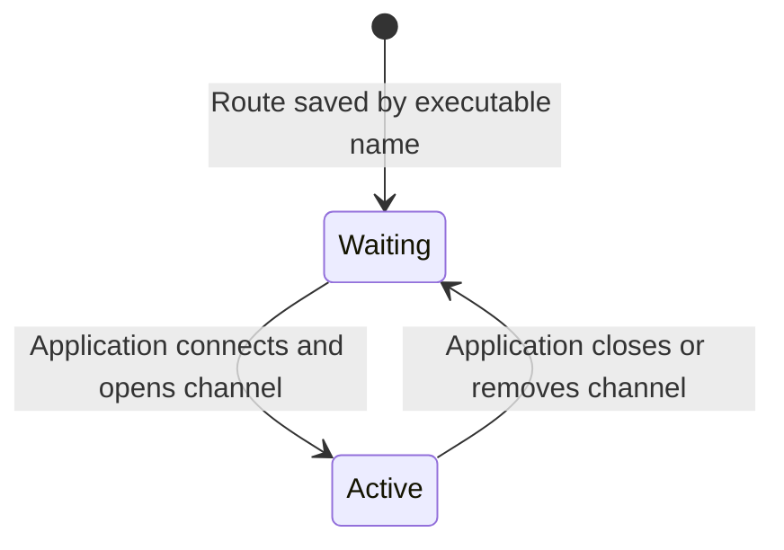

# Using Timox VASIO Control 1.1.0

[Français](FONCTIONS_1.1.0.md) | **English**

This guide describes the features in [TimoxVasio 1.1.0](https://github.com/timox/TimoxVasio/releases/tag/v1.1.0).

| View | Main use |
| --- | --- |
| **Configuration** | Select the physical ASIO driver, sample rate, and buffer size; configure per-application channel profiles. |
| **Channels** | Inspect connected applications, open and routed channels, and meters; expand the routing matrix to edit routes. |
| **Analysis** | Follow L/R correlation for an open, routed stereo output pair. |
| **API and Swagger** | Read the embedded contract and send HTTP requests or WebSocket commands from the integrated console. |
| **Logs** | Inspect engine events and set the diagnostic level. |

## Three components, two paths



Samples follow the audio path. Control, Swagger, and the console use the local API to read state and send commands; they do not transport samples. The engine must be running before an ASIO application opens TimoxVasio buffers. See [Installation](../INSTALL.en.md) for startup order.

## Open channels, routes, and meters

An application profile can advertise up to 256 inputs and 256 outputs. Only channels it opens through ASIO become active endpoints. An open channel is not automatically routed. In **Channels**, meters appear only for the application's channels that are both open and part of an active route.



`audio.meter` associates a dBFS peak with an `endpointId` and includes cumulative `underruns` and `overruns` counters for client transport:

```json
{
  "event": "audio.meter",
  "payload": {
    "endpointId": "virtual:TimoxVasio:1234:output:1",
    "peakDbfs": -9.0,
    "underruns": 0,
    "overruns": 0
  }
}
```

The API emits measurements about twice per second. Silence is represented as `-120` dBFS. The UI bar covers `-60` to `0` dBFS while its numeric label retains the received value. These counters describe virtual transport rings; alone they do not measure missed physical callback deadlines.

## L/R stereo correlation

**Analysis** offers adjacent output pairs from one application when both channels are open and routed. Select a pair and start analysis. The graph plots a coefficient from `-1` to `+1`:

| Value | Meaning |
| --- | --- |
| Near `+1` | Signals vary together. |
| Near `0` | Weak correlation over the measured window. |
| Near `-1` | Signals vary in opposition. |
| `null`, state `no_signal` | At least one channel is silent or too quiet for reliable measurement. |

The engine computes a normalized, zero-lag correlation over roughly 100 ms windows. If either channel's RMS is below `-90` dBFS, it reports `no_signal`. The coefficient describes the relationship between L and R, not a phase angle in degrees; `0` does not mean silence.



## Persistent routes across reconnections

`GET /api/v1/state` contains `configuredRoutes` (all saved routes) and `routes` (those currently active with open channels). A virtual route saved under an executable name, such as `virtual:TimoxVasio:app:renoise.exe:output:1`, waits for that application to reconnect. Once its channel opens, the API reports the active route with the current PID in `endpointId`.



For example, with no application connected, state may show eight `configuredRoutes` and zero `routes`. The engine retains the eight routes and does not start a physical audio stream until a route becomes active. To create a new waiting route, the application must have a profile in `GET /api/v1/application-profiles`, and the channel number must fit that profile. `configuration.apply` replaces the entire list: send **all** routes you want to keep. Reconfiguration may briefly interrupt audio.

## Integrated API console and programming examples

Open **API and Swagger**. Swagger describes HTTP endpoints, WebSocket commands, and schemas. The **API Console** provides request templates, a JSON editor, and a response panel. `configuration.apply` and `engine.stop` require confirmation in Control.

To read state without changing the engine, select **HTTP request** and enter:

```json
{ "method": "GET", "path": "/api/v1/state" }
```

The same request in PowerShell:

```powershell
$state = Invoke-RestMethod 'http://127.0.0.1:52525/api/v1/state'
$state.engine | Format-List
$state.configuredRoutes | Format-Table id, sourceEndpointId, destinationEndpointId
$state.stereoPairs | Format-Table id, label
```

To start correlation in the WebSocket console, use an `id` actually returned in `stereoPairs`:

```json
{
  "id": "analysis-1",
  "command": "audio.correlation.start",
  "payload": { "stereoPairId": "stereo:TimoxVasio:1234:output:1-2" }
}
```

To receive measurements in Node.js, install `ws` with `npm install ws` and use the documented `vasio.api.v1` subprotocol:

```javascript
const WebSocket = require('ws');
const socket = new WebSocket('ws://127.0.0.1:52525/api/v1/ws', 'vasio.api.v1');

socket.on('message', raw => {
  const message = JSON.parse(raw.toString());
  if (message.event === 'audio.meter') {
    const { endpointId, peakDbfs } = message.payload;
    console.log(endpointId, `${peakDbfs.toFixed(1)} dBFS`);
  }
  if (message.event === 'audio.correlation') {
    const { correlation, state } = message.payload;
    console.log(state, correlation);
  }
});

socket.on('error', error => console.error(error.message));
```

To activate correlation in a program, first read `GET /api/v1/state`, select a pair from `stereoPairs`, and send the `audio.correlation.start` command above. A missing or unrouted pair is rejected. See the [API contract](../API.en.md) and [API quick start](API_QUICKSTART.en.md) for configuration and diagnostics.
