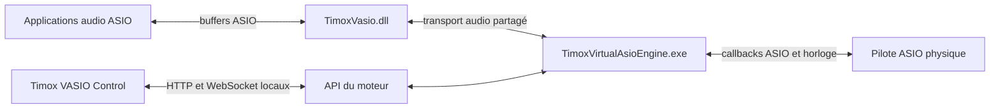
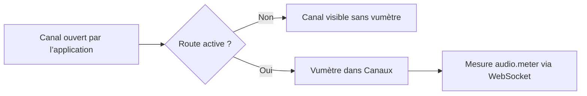
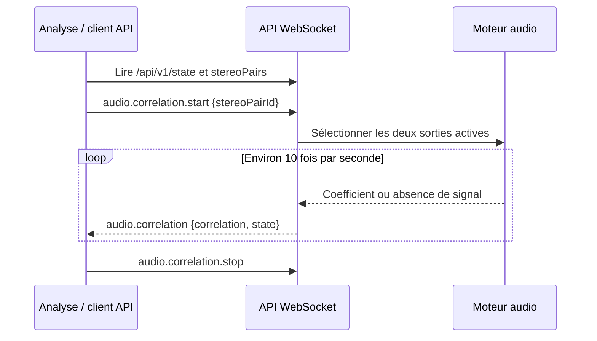
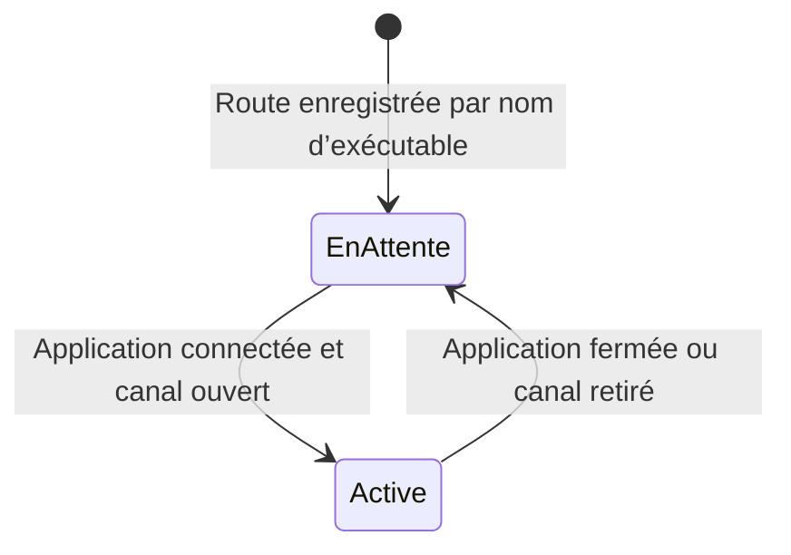

# Utiliser Timox VASIO Control 1.1.0

**Français** | [English](FONCTIONS_1.1.0.en.md)

Cette page décrit les fonctions livrées avec [TimoxVasio 1.1.0](https://github.com/timox/TimoxVasio/releases/tag/v1.1.0). L’application Windows réunit cinq vues :

| Vue | Usage principal |
| --- | --- |
| **Configuration** | Choisir le pilote ASIO physique, sa fréquence et son tampon; régler les profils de canaux par application. |
| **Canaux** | Voir les applications connectées, les canaux ouverts et routés, leurs niveaux, puis déplier la matrice pour modifier les routes. |
| **Analyse** | Suivre la corrélation des sorties gauche et droite d’une paire stéréo ouverte et routée. |
| **API et Swagger** | Lire le contrat embarqué et envoyer des requêtes HTTP ou commandes WebSocket depuis la console intégrée. |
| **Journaux** | Consulter les événements du moteur et choisir le niveau de diagnostic. |

## Trois composants et deux chemins distincts



Les échantillons suivent le chemin du haut. L’interface, Swagger et la console utilisent l’API locale pour lire l’état et envoyer des commandes; ils ne transportent pas les échantillons. Le moteur doit fonctionner avant qu’une application ASIO puisse ouvrir ses buffers TimoxVasio. Le guide [Installation](../INSTALL.md) décrit l’ordre de lancement.

## Canaux ouverts, routes et vumètres

Une application peut recevoir un profil annonçant jusqu’à 256 entrées et 256 sorties. Seuls les canaux qu’elle ouvre avec ASIO deviennent des extrémités actives. Un canal ouvert n’est pas automatiquement routé. Dans **Canaux**, les vumètres sont affichés uniquement pour les canaux de cette application qui sont à la fois ouverts et présents dans une route active.



L’événement `audio.meter` associe un niveau de crête en dBFS à un `endpointId` et fournit les compteurs cumulés `underruns` et `overruns` du transport client :

```json
{
  "event": "audio.meter",
  "payload": {
    "endpointId": "virtual:TimoxVasio:1234:output:1",
    "peakDbfs": -9.0,
    "underruns": 0,
    "overruns": 0
  }
}
```

L’API publie les mesures environ deux fois par seconde. Elle représente le silence par `-120` dBFS. La barre de l’interface couvre `-60` à `0` dBFS, tandis que le nombre affiché conserve la valeur reçue. Les compteurs concernent les anneaux du transport virtuel; ils ne mesurent pas à eux seuls les échéances manquées du callback physique.

## Corrélation stéréo L/R

La vue **Analyse** propose les paires de sorties adjacentes d’une même application dont les deux canaux sont ouverts et routés. Choisissez une paire, puis lancez l’analyse. Le graphique montre l’évolution du coefficient entre `−1` et `+1` :

| Valeur | Lecture |
| --- | --- |
| Proche de `+1` | Les deux signaux évoluent ensemble. |
| Proche de `0` | Faible corrélation sur la fenêtre mesurée. |
| Proche de `−1` | Les signaux évoluent en opposition. |
| `null`, état `no_signal` | Un canal est silencieux ou trop faible pour une mesure fiable. |

Le moteur calcule une corrélation normalisée à décalage nul sur des fenêtres d’environ 100 ms. Sous `−90` dBFS RMS sur l’un des deux canaux, il publie `no_signal`. Le coefficient indique une relation entre les signaux L/R; il ne mesure pas un angle de phase en degrés et `0` ne signifie pas « silence ».



## Routes persistantes quand une application se reconnecte

`GET /api/v1/state` contient deux listes : `configuredRoutes` regroupe toutes les routes enregistrées; `routes` ne contient que celles qui peuvent être activées avec les canaux actuellement ouverts. Une route virtuelle enregistrée sous le nom de l’exécutable, par exemple `virtual:TimoxVasio:app:renoise.exe:output:1`, attend la reconnexion de l’application. Une fois le canal ouvert, l’API publie la route active avec le PID courant dans son `endpointId`.



Un exemple d’état sans application connectée est `configuredRoutes: 8`, `routes: 0`. Le moteur conserve les huit routes; il ne lance aucun flux physique tant qu’aucune route n’est active. Pour créer une nouvelle route en attente, l’application doit disposer d’un profil dans `GET /api/v1/application-profiles`, et le numéro de canal doit rester dans les limites de ce profil. Lors d’un `configuration.apply`, envoyez **toutes** les routes à conserver : la commande remplace la liste complète et peut interrompre brièvement le flux.

## Console API intégrée et exemples de programmation

Ouvrez **API et Swagger**. Swagger décrit les routes HTTP, les commandes WebSocket et leurs schémas. La **Console API** offre des modèles de requêtes, un éditeur JSON et une zone de réponse. Les commandes `configuration.apply` et `engine.stop` demandent une confirmation dans l’interface.

Pour lire l’état sans modifier le moteur, sélectionnez **Requête HTTP** et utilisez :

```json
{ "method": "GET", "path": "/api/v1/state" }
```

La même lecture en PowerShell :

```powershell
$state = Invoke-RestMethod 'http://127.0.0.1:52525/api/v1/state'
$state.engine | Format-List
$state.configuredRoutes | Format-Table id, sourceEndpointId, destinationEndpointId
$state.stereoPairs | Format-Table id, label
```

Pour démarrer une corrélation depuis la console WebSocket, remplacez l’identifiant par un `id` réellement renvoyé dans `stereoPairs` :

```json
{
  "id": "analyse-1",
  "command": "audio.correlation.start",
  "payload": { "stereoPairId": "stereo:TimoxVasio:1234:output:1-2" }
}
```

Un programme Node.js peut écouter les mesures en utilisant le sous-protocole documenté `vasio.api.v1` et le paquet `ws` (`npm install ws`) :

```javascript
const WebSocket = require('ws');
const socket = new WebSocket('ws://127.0.0.1:52525/api/v1/ws', 'vasio.api.v1');

socket.on('message', raw => {
  const message = JSON.parse(raw.toString());
  if (message.event === 'audio.meter') {
    const { endpointId, peakDbfs } = message.payload;
    console.log(endpointId, `${peakDbfs.toFixed(1)} dBFS`);
  }
  if (message.event === 'audio.correlation') {
    const { correlation, state } = message.payload;
    console.log(state, correlation);
  }
});

socket.on('error', error => console.error(error.message));
```

Pour activer la corrélation dans ce programme, commencez par lire `GET /api/v1/state`, choisissez une paire dans `stereoPairs`, puis envoyez la commande `audio.correlation.start` ci-dessus. Une requête sur une paire absente ou non routée est refusée. La [référence API](../API.md) et le [quick start](API_QUICKSTART.md) donnent le contrat complet de configuration et de diagnostics.
