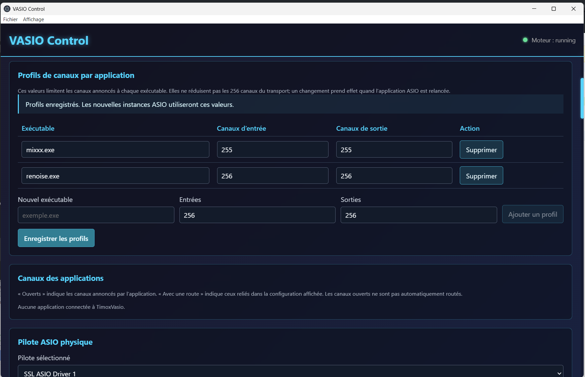
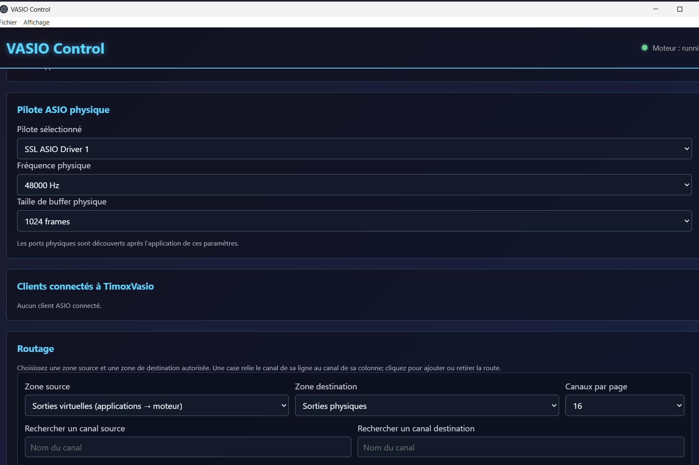
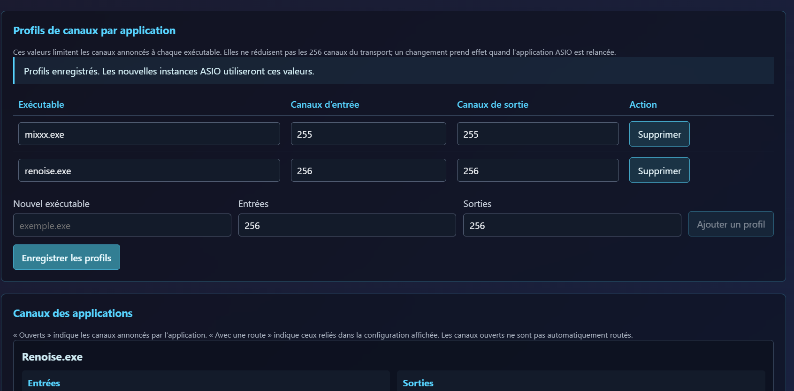
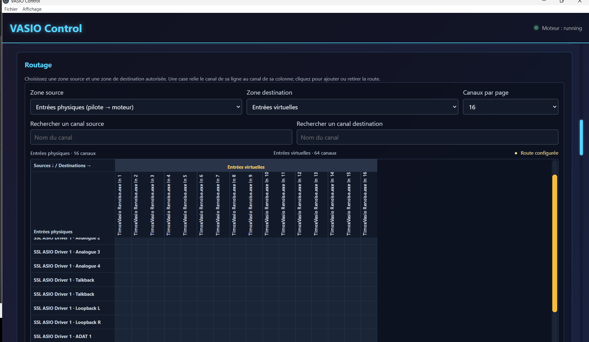
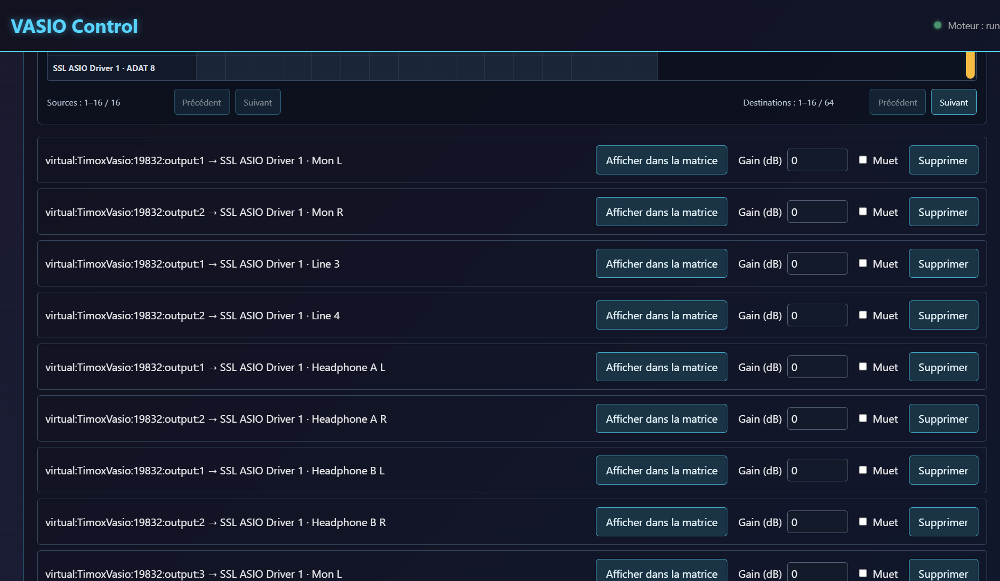

# Revue UX/UI de Timox VASIO Control

## Périmètre

Parcours examiné : régler les profils d’applications, choisir le périphérique
ASIO physique, construire une route dans la matrice et vérifier/modifier les
routes créées. Les cinq captures ci-dessous ont été fournies par l’utilisateur
le 4 octobre 2026. Elles montrent l’application actuellement ouverte, dont
l’en-tête affiche « VASIO Control » et dont les onglets Journaux/Swagger ne
sont pas visibles. Elles ne montrent donc pas la build candidate reconstruite
ensuite.

## Étapes et état général

### 1. Profils de canaux — sain, avec une hiérarchie visuelle trop forte

Les profils sont groupés dans une carte, avec des colonnes explicites pour
l’exécutable, les entrées, les sorties et l’action. Le message confirme
l’enregistrement et indique que les applications doivent être relancées.
Cette confirmation aide à comprendre quand le changement prend effet. En
revanche, le titre cyan lumineux domine le contenu et attire davantage
l’attention que le statut du moteur.

### 2. Périphérique physique et clients — sain

Le pilote, le taux et la taille de buffer sont présentés comme un groupe
cohérent. L’état vide « Aucune application connectée à TimoxVasio » est
explicite. Une autre capture montre l’état avec Renoise connecté et ses
canaux publiés.

### 3. Matrice de routage — utilisable, mais dense

Les zones source/destination, la pagination et les recherches sont séparées et
nommées. Les barres de défilement ambre de la matrice se distinguent du fond.
Les noms complets des canaux sont tournés verticalement, ce qui rend leur
lecture lente et répétitive; une grande partie de la largeur reste vide quand
seulement 16 colonnes sont affichées. La capture sélectionne entrées physiques
vers entrées virtuelles, mais la configuration visible ailleurs contient des
routes virtuelles vers sorties physiques. La légende statique « Route
configurée » laisse croire qu’une route existe dans cette matrice précise.

La légende a été corrigée dans le code : elle indique maintenant le nombre de
routes dans la page affichée ou « Aucune route dans cette vue ». Le build
React et les paquets Electron candidats ont été reconstruits après cette
correction. Les captures fournies précèdent ce changement.

### 4. Liste des routes — commandes visibles, libellés trop techniques

Les commandes « Afficher dans la matrice », gain, mute et suppression sont
faciles à repérer. Les routes sont toutefois présentées avec des identifiants
techniques répétés (`virtual:TimoxVasio:<PID>:output:<canal>`), ce qui rend
difficile le balayage visuel d’une longue liste. Une amélioration ultérieure
devrait fournir des noms d’endpoints lisibles depuis l’API et garder
l’identifiant technique en détail.

## Couleurs, texte, surfaces et accessibilité

- Le texte courant et les contrôles restent lisibles sur les surfaces sombres.
  Les accents cyan saturés et l’ombre lumineuse du titre sont trop présents.
- Les sections sont distinctes, mais l’ancien CSS réactivait le cyan vif sur
  les titres de section et les barres de défilement après les nouveaux tokens.
  Ces règles de cascade ont été corrigées : accent plus doux, titre de section
  à 20 px, barres générales neutres sans halo, pile de polices héritée depuis
  un seul endroit.
- La taille de base est de 16 px; les contrôles mesurent au moins 40 px et les
  aides 14 px. Les contours des cartes et contrôles sont visibles.
- Le code utilise des en-têtes de lignes/colonnes et des boutons de cellule
  avec libellés accessibles. La capture seule ne permet pas de valider la
  navigation clavier, les lecteurs d’écran, le contraste calculé ni le zoom.

## Vérifications encore nécessaires

- Capturer les mêmes étapes dans la build candidate, puis vérifier visuellement
  l’effet des corrections de cascade.
- Capturer la vue Journaux et la vue API/Swagger; elles ne figurent pas dans
  les images fournies.
- Vérifier la navigation clavier, le focus visible, le redimensionnement et la
  lecture de la matrice avec un lecteur d’écran.

Cette revue est fondée sur les cinq captures et l’inspection des sources
React/CSS. Elle ne constitue pas une déclaration de conformité WCAG.
